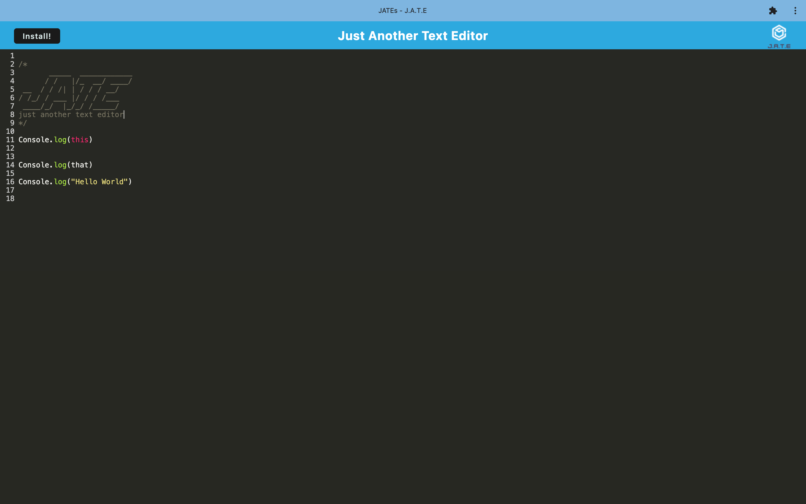

# PWA Text Editor

## Description

AS A developer
I WANT to create notes or code snippets with or without an internet connection
SO THAT I can reliably retrieve them for later use

GIVEN a text editor web application
WHEN I open my application in my editor
THEN I should see a client server folder structure

WHEN I run `npm run start` from the root directory
THEN I find that my application should start up the backend and serve the client

WHEN I run the text editor application from my terminal
THEN I find that my JavaScript files have been bundled using webpack

WHEN I run my webpack plugins
THEN I find that I have a generated HTML file, service worker, and a manifest file

WHEN I use next-gen JavaScript in my application
THEN I find that the text editor still functions in the browser without errors

WHEN I open the text editor
THEN I find that IndexedDB has immediately created a database storage

WHEN I enter content and subsequently click off of the DOM window
THEN I find that the content in the text editor has been saved with IndexedDB

WHEN I reopen the text editor after closing it
THEN I find that the content in the text editor has been retrieved from our IndexedDB

WHEN I click on the Install button
THEN I download my web application as an icon on my desktop

WHEN I load my web application
THEN I should have a registered service worker using workbox

WHEN I register a service worker
THEN I should have my static assets pre cached upon loading along with subsequent pages and static assets

WHEN I deploy to Heroku
THEN I should have proper build scripts for a webpack application

## Table of Contents

- [Installation](#installation)

- [Usage](#usage)

- [Questions](#questions)

## Installation

- Step 1: The user will need to have [Node.js](https://nodejs.org/en/download) installed on their PC or use the link provided to install it.

- Step 2: Before running the program the user will need to install the packages by typing 'npm install' into the terminal integrated to the location of the folder holding the program and then 'npm run start'.

- Step 3: The user will need to set up a Heroku profile.

- Step 4: The user will need to have a Heroku installed on their PC, this can be achieved by typing 'npm install -g heroku' into their terminal.

- Step 5: Heroku will need to be linked to your GitHub account. This can be accomplished after creating the app, under deployment method select GitHub.

## Usage

Link to app: https://extra-progressive-text-editor-9dd627b180ce.herokuapp.com/

This application was designed to create notes or code snippets with or without an internet connection. you can type into the note taker and the information will be saved to a database for the user to revisit. 

## Questions

Regarding any questions please check out my Github profile [JakeHowdeshell](https://github.com/JakeHowdeshell).

Or send me an [email](mailto:Jakehowdy@gmail.com).